# 🚀 Python Data Processing & Asynchronous ETL Pipeline

이 프로젝트는 대용량 로그 처리부터 Pydantic 검증, asyncio 비동기 수집기, 그리고 비동기 ETL 파이프라인 구축 및 단위 테스트 실습 내용을 담고 있습니다.

---

## 🛠️ 목차
1. [실습 1. 대용량 로그 스트리밍 집계](#실습-1-대용량-로그-스트리밍-집계)
2. [실습 2. Pydantic v2 중첩 스키마 검증](#실습-2-pydantic-v2-중첩-스키마-검증)
3. [실습 3. asyncio 기반 비동기 수집기](#실습-3-asyncio-기반-비동기-수집기)
4. [종합 실습 1. 비동기 ETL 파이프라인](#종합-실습-1-비동기-etl-파이프라인)
5. [추가 과제](#추가-과제)

---

## 실습 1. 대용량 로그 스트리밍 집계

### STEP 0. 데이터 형태 확인

    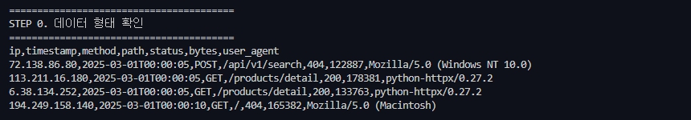

### STEP 1. 파일 -> 딕셔너리 제너레이터

    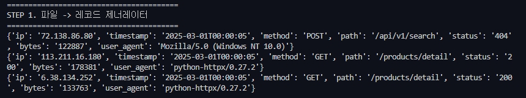

### STEP 2 + 3. 집계 코드 작성

    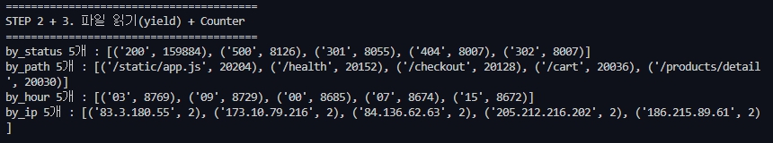

### STEP 4. 5xx 비율 계산

    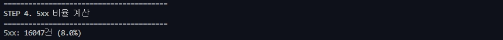

### STEP 5. fold 패턴

    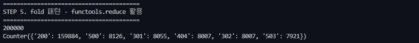

### STEP 6. 리포트 및 상위 IP 출력

    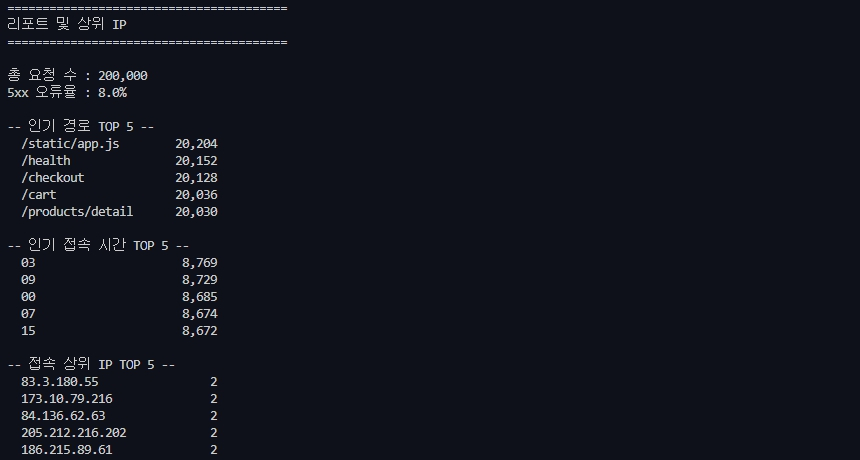

---

## 실습 2. Pydantic v2 중첩 스키마 검증

### STEP 0 · 오염 데이터 확인

    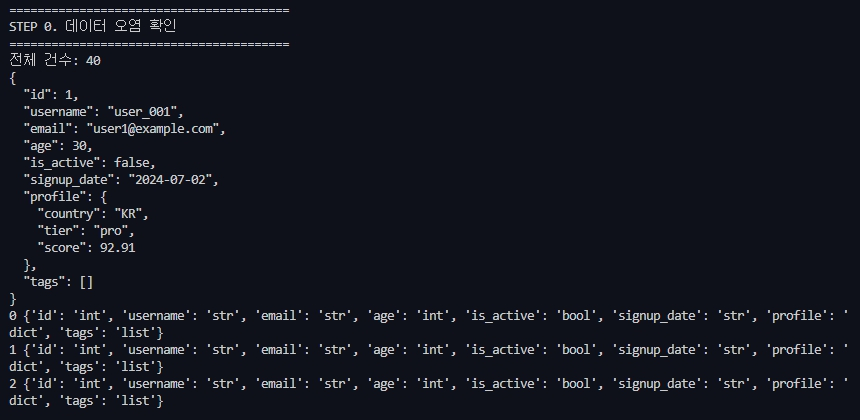

- **7번 유저** : 나이가 음수값(-5)로 설정됨
- **13번 유저** : 이메일 값이 "not-an-email"으로 형식을 벗어남
- **21번 유저** : 이메일 태그 없음
- **29번 유저** : score가 150.0으로 100점 초과

### STEP 1 ~ 4. 모델 생성 및 규약 설정

    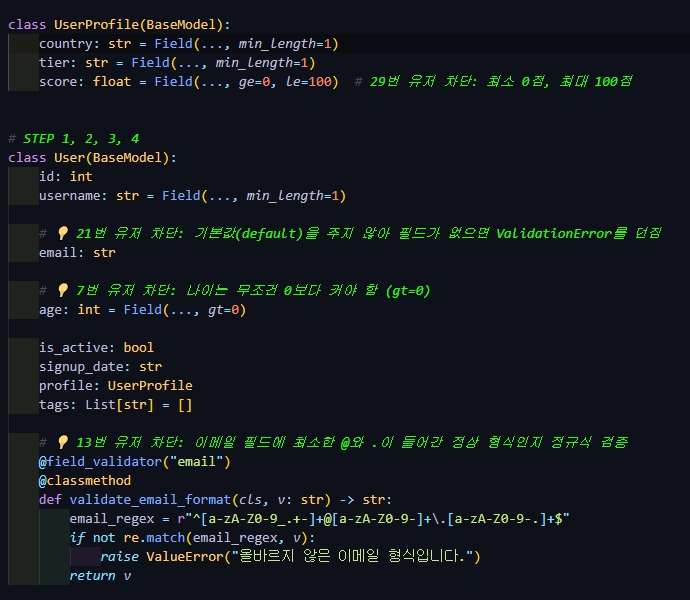

### STEP 5 · 40건을 돌리며 유효/무효로 나누기

    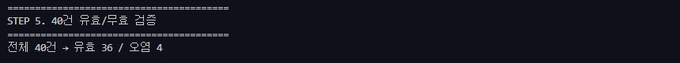

### STEP 6 · 탈락 사유를 표로 출력 (확장 과제)

    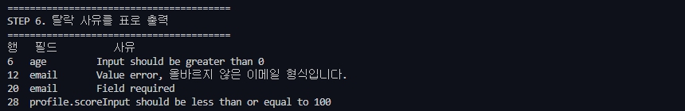

---

## 실습 3. asyncio 기반 비동기 수집기

### STEP 0. 동기 버전

    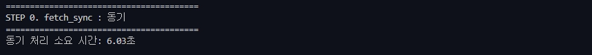

### STEP 1. async/await 비동기

    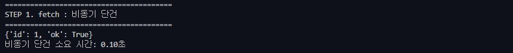

### STEP 2. gather로 60개 동시에 던지기

    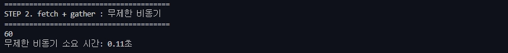

### STEP 3. 백프레셔 — Semaphore 로 동시 요청 수 제한

    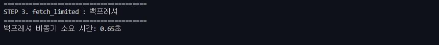

### STEP 4. 타임아웃 — 무한정 기다리지 않기

    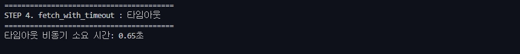

### STEP 5. 재시도 — 지수 백오프(exponential backoff)

    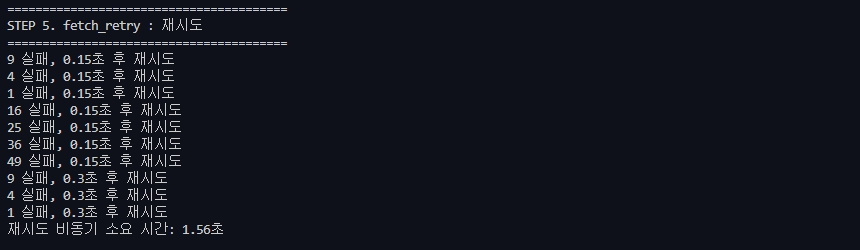

### STEP 6. 예외 격리 — 하나 실패해도 전체는 살리기

    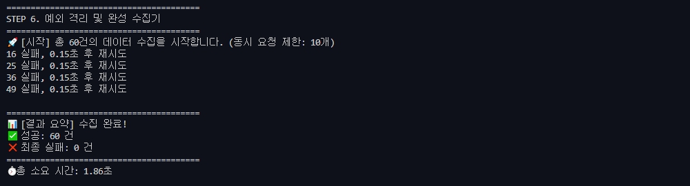

---

## 종합 실습 1. 비동기 ETL 파이프라인

### STEP 0 ~ 2. 테스트 점진적 접근(폴더 구조 > Transform > 테스트 코드)

    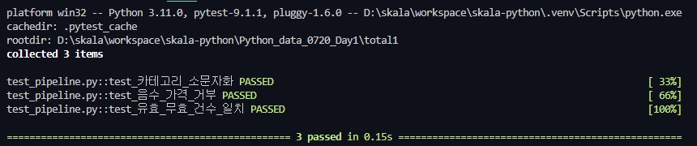

### STEP 3 ~ 6. Extract, Load, Parquet 라운드 트립 + 테스트 코드

    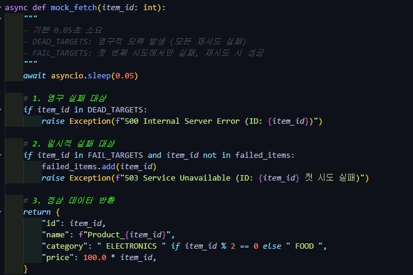 
    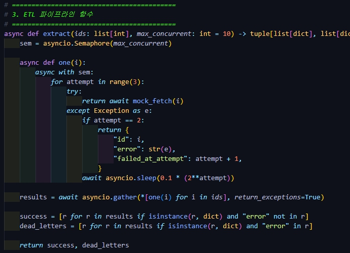 
    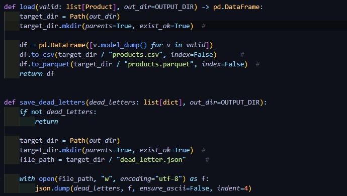 
    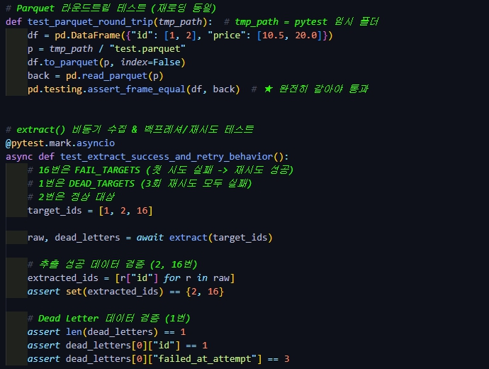 
    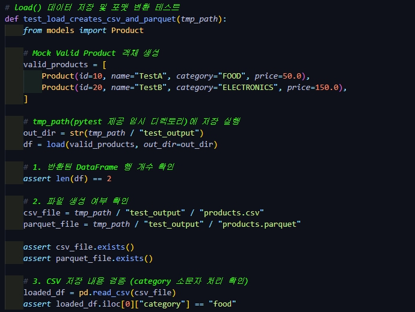 
    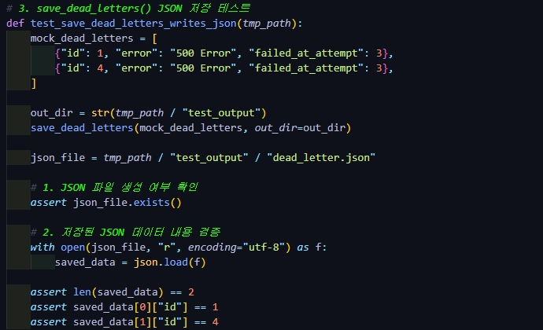 
    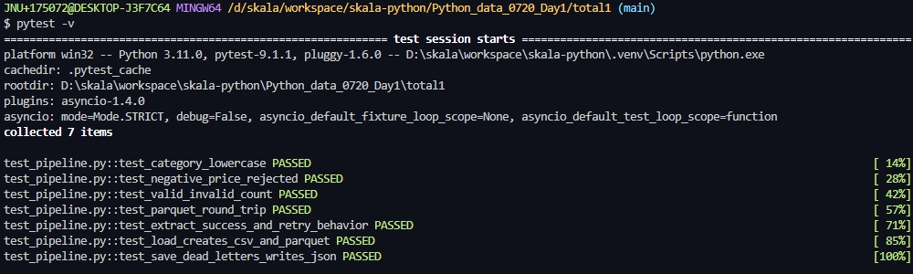 
    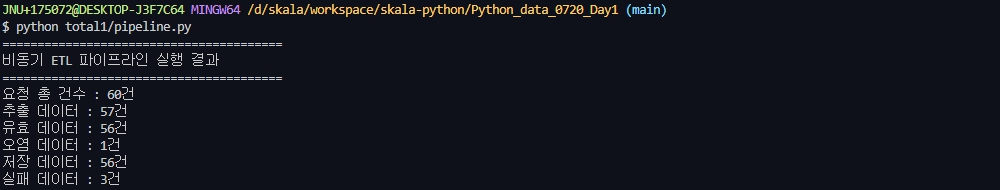

- `extract()` 위한 `mock_fetch` 추가
- `load()` : 데이터 csv, parquet 저장
- `save_dead_letters` : dead_letters 격리 및 기록

### STEP 7. Ruff 로 마무리

    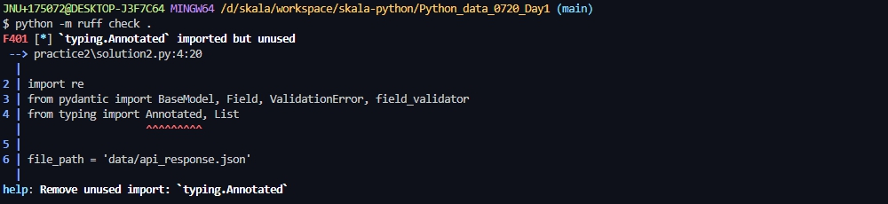 
    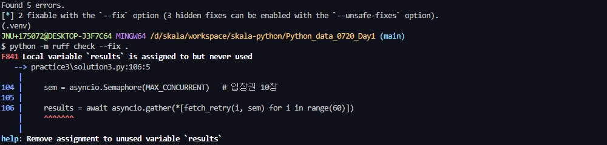 
    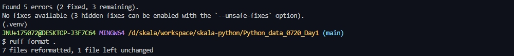 
    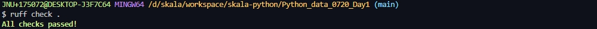 
    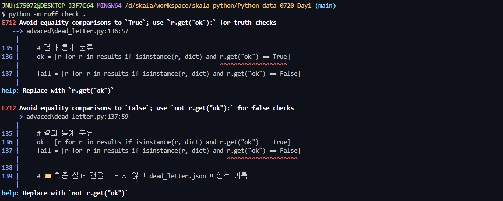

- 'True', 'False'로 바꿔야 ruff passed이나 잘못된 결과 나오므로 무시

---

## 추가 과제

### 1. tracemalloc

    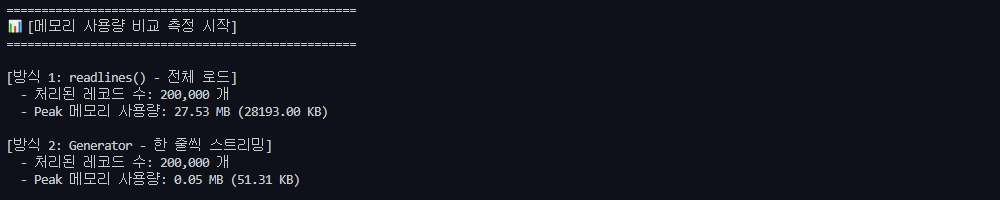

- readlines와 제너레이터 메모리 비교

### 2. dead_letters

    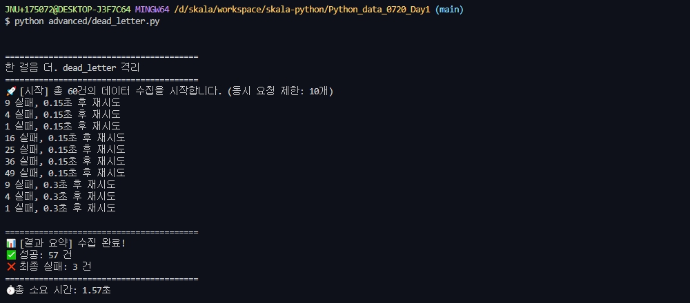

- 실패 데이터 격리 및 json 기록
