# 🚀 Python Data Processing & Asynchronous ETL Pipeline

> 대용량 로그 스트리밍 처리, Pydantic 데이터 검증, asyncio 기반 비동기 수집, 데이터 정제(Pandas/Polars/DuckDB) 및 자동화된 ETL/리포팅 파이프라인 구축 및 단위 테스트 실습 모음입니다.

---

## 🛠️ 목차
1. [실습 1. 대용량 로그 스트리밍 집계](#실습-1-대용량-로그-스트리밍-집계)
2. [실습 2. Pydantic v2 중첩 스키마 검증](#실습-2-pydantic-v2-중첩-스키마-검증)
3. [실습 3. asyncio 기반 비동기 수집기](#실습-3-asyncio-기반-비동기-수집기)
4. [실습 4. Pandas 2.x 데이터 정제](#실습-4-pandas-2x-데이터-정제)
5. [실습 5. Polars, DuckDB 성능 비교](#실습-5-polars-duckdb-성능-비교)
6. [종합 실습 1. 비동기 ETL 파이프라인](#종합-실습-1-비동기-etl-파이프라인)
7. [종합 실습 2. EDA + 통계 + ML 파이프라인](#종합-실습-2-eda--통계--ml-파이프라인)
8. [종합 실습 3. 분석 자동화 · 리포트 생성](#종합-실습-3-분석-자동화--리포트-생성)
9. [추가 과제](#추가-과제)

---

## 실습 1. 대용량 로그 스트리밍 집계

대용량 텍스트 로그 파일을 메모리에 효율적으로 적재하기 위해 **제너레이터(Generator)** 및 **Fold 패턴**을 활용한 스트리밍 처리 파이프라인입니다.

### STEP 0. 데이터 형태 확인

    

### STEP 1. 파일 -> 딕셔너리 제너레이터

    

### STEP 2 + 3. 집계 코드 작성

    

### STEP 4. 5xx 비율 계산

    

### STEP 5. Fold 패턴 적용

    

### STEP 6. 리포트 및 상위 IP 출력

    

---

## 실습 2. Pydantic v2 중첩 스키마 검증

강력한 데이터 검증 라이브러리인 **Pydantic v2**를 사용하여 비정상/오염 데이터를 식별하고 파싱 에러를 트래킹합니다.

### STEP 0 · 오염 데이터 확인

    

* **7번 유저**: 나이가 음수값(`-5`)으로 설정됨
* **13번 유저**: 이메일 값이 `"not-an-email"`으로 형식을 벗어남
* **21번 유저**: 이메일 태그 누락
* **29번 유저**: score가 `150.0`으로 100점 초과

### STEP 1 ~ 4. 모델 생성 및 규약 설정

    

### STEP 5 · 40건 데이터 검증 (Valid / Invalid 분리)

    

### STEP 6 · 탈락 사유 요약 표 출력 (확장 과제)

    

---

## 실습 3. asyncio 기반 비동기 수집기

동기 처리 대비 대규모 웹 수집 성능을 극대화하기 위해 **asyncio**, **Semaphore**, **지수 백오프(Exponential Backoff)** 등의 비동기 제어 기법을 적용했습니다.

### STEP 0. 동기 방식 실행

    

### STEP 1. async / await 기본 구성

    

### STEP 2. asyncio.gather로 동시 60개 요청

    

### STEP 3. 백프레셔 (Semaphore 기반 동시 요청 제어)

    

### STEP 4. 타임아웃 제어

    

### STEP 5. 재시도 메커니즘 (지수 백오프)

    

### STEP 6. 예외 격리 (단일 실패 건 독립 처리)

    

---

## 실습 4. Pandas 2.x 데이터 정제

### STEP 0. 데이터 진단

    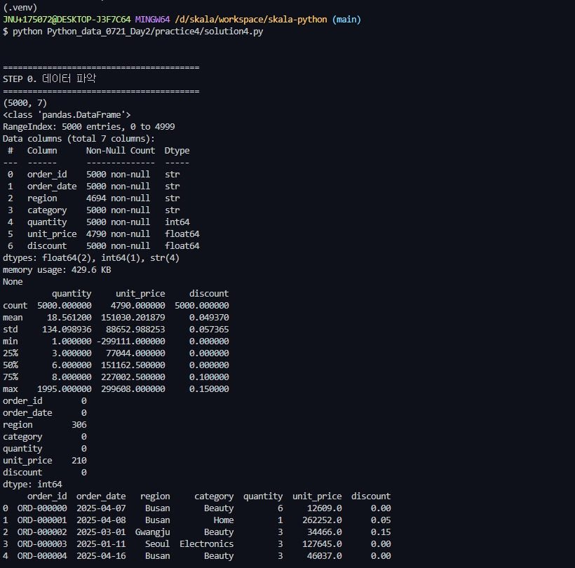

### STEP 1 ~ 5. 타입 정규화, 결측치/이상치 처리, Groupby 집계, Pivot Table

    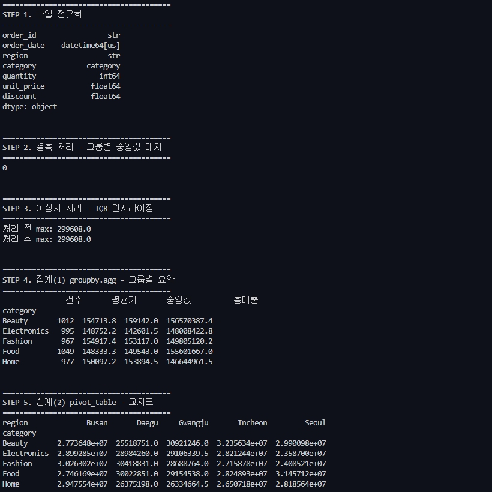

### STEP 6. Merge를 통한 이종 데이터 결합

    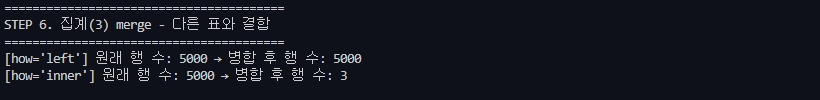

---

## 실습 5. Polars, DuckDB 성능 비교

동일한 쿼리를 **Pandas**, **Polars (Lazy Engine)**, **DuckDB (SQL Direct Query)** 3가지 엔진에서 실행하고 수행 속도 및 메모리 효율성을 비교합니다.

### STEP 0. 기준 질의(Query) 설정
* 동일한 데이터셋 및 조건으로 처리 기준 통일

### STEP 1. Pandas 기준선 측정

    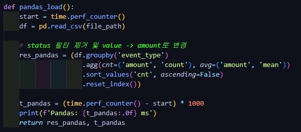

### STEP 2. Polars Lazy Execution (`scan_csv` + `collect`)

    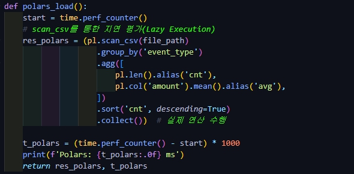

### STEP 3. DuckDB Direct SQL Query

    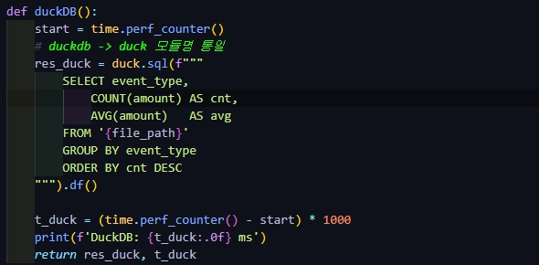

### STEP 4 ~ 5. 결과 검증 및 벤치마크 정리

    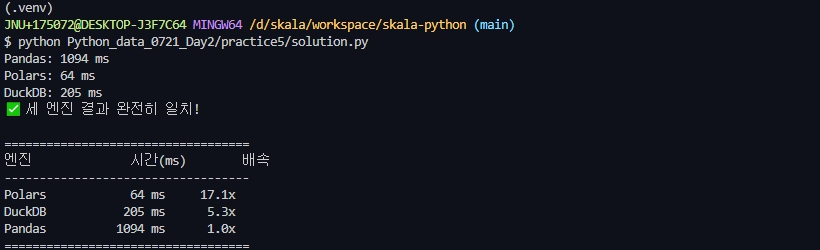

---

## 종합 실습 1. 비동기 ETL 파이프라인

모듈화된 파이프라인 설계, 비동기 Extract/Load 과정, Parquet 저장 및 Dead Letter Queue 처리 능력을 다룹니다.

### STEP 0 ~ 2. 점진적 모듈 설계 및 테스트 구성

    

### STEP 3 ~ 6. Extract / Load / Parquet Round-trip & 단위 테스트

     
     
     
     
     
     
     
    

* `extract()`: 비동기 데이터 수집을 위한 `mock_fetch` 구현
* `load()`: CSV 및 Parquet 포맷으로 정제 데이터 저장
* `save_dead_letters`: 실패/오염 데이터 격리 및 로그 관리

### STEP 7. 코드 린팅 (Ruff)

     
     
     
     
    

---

## 종합 실습 2. EDA + 통계 + ML 파이프라인

### STEP 0. 탐색적 데이터 분석 (EDA)

    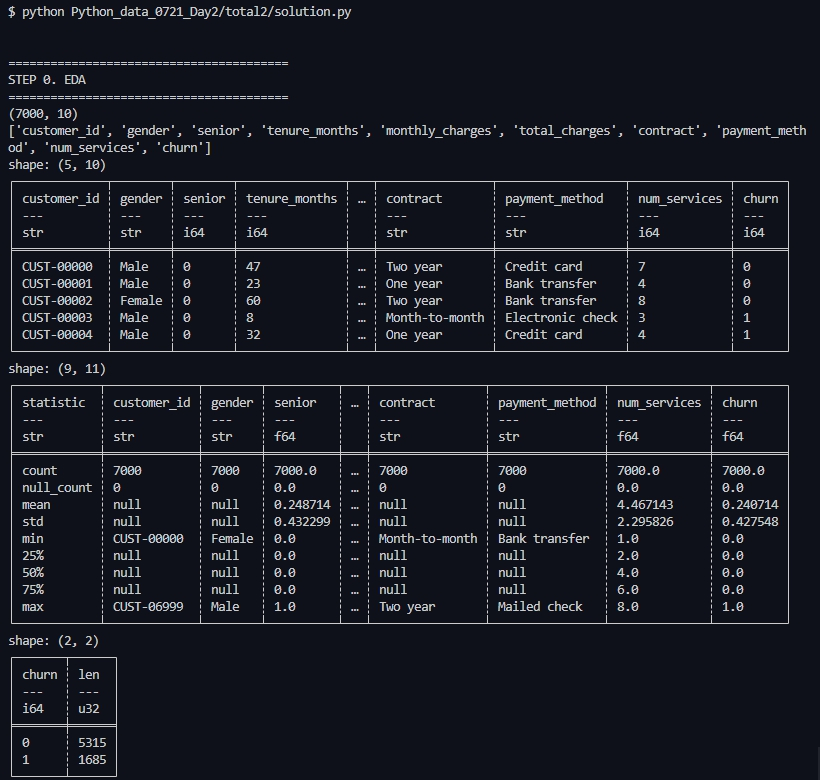

### STEP 1 ~ 3. 그룹 비교, Plotly 시각화 리포트 및 통계 검정

    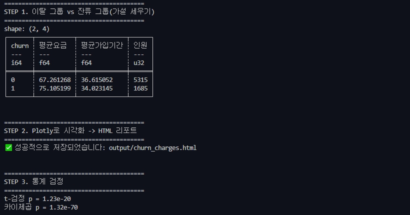

* **Two-sample t-test**: $p = 1.23 \times 10^{-20}$
* **Chi-square test**: $p = 1.32 \times 10^{-70}$

### STEP 7. 모델 평가 (ROC-AUC)

    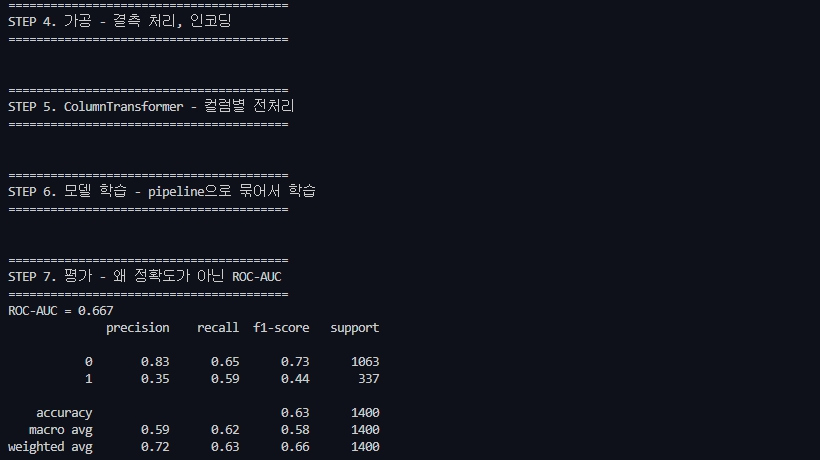

* **ROC-AUC**: `0.667` (불균형 데이터셋 특성을 고려하여 Accuracy 대신 ROC-AUC 지표 적용)

---

## 종합 실습 3. 분석 자동화 · 리포트 생성

### STEP 0. 설정 파일 (`config.py`)

    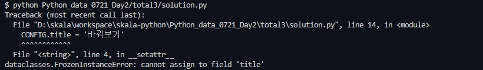

### STEP 3. Jinja2 기반 HTML 템플릿 렌더링

    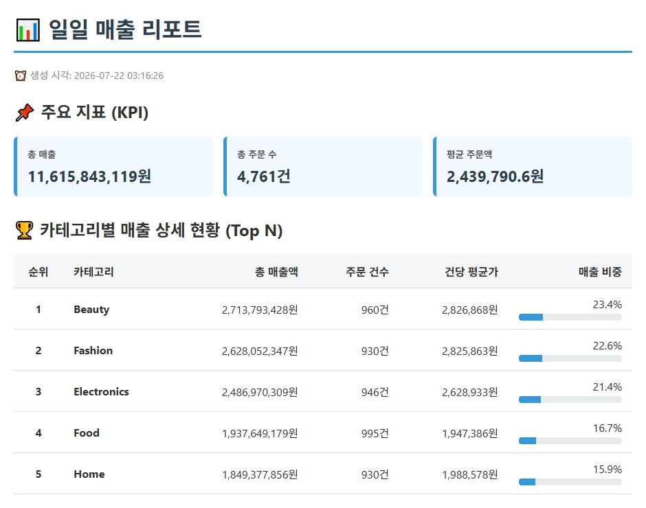

### STEP 4. 실행 모드 1: 경량 루프 (`while` + `sleep`)

    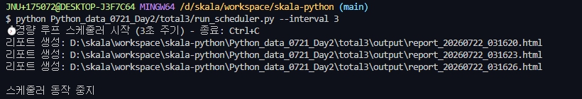

### STEP 5. 실행 모드 2: `schedule` 라이브러리

    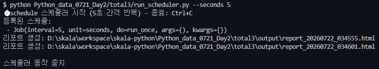

### STEP 6. 실행 모드 3: OS cron
* 시스템 크론(cron) 데몬 설정을 통해 무인 서버 자동 스케줄링 구성 지원

---

## 추가 과제

### 1. `tracemalloc` 메모리 프로파일링

    

* `readlines()` (전체 적재) vs `Generator` (스트리밍) 메모리 사용량 실증 비교

### 2. Dead Letter Queue 격리 시스템

    

* ETL 과정 중 검증 실패 데이터의 JSON 이력 격리 및 자동 기록

### 3. 데이터 정제 모듈화 및 테스트 코드 작성

    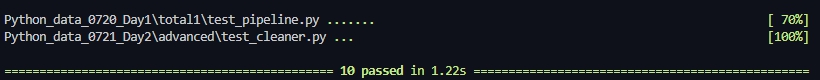

* `advanced/cleaner.py`: 정제 로직 함수화
* `advanced/test_cleaner.py`: `pytest` 기반 단위 테스트 케이스 구성
